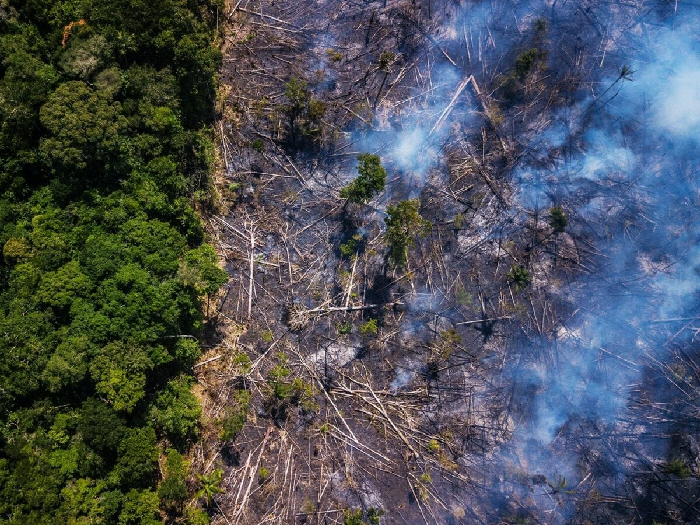

2019年8月28日

① Smoke obscured the skyline of Sao Paulo on August 19 as fires were raging in the Amazon rainforest 1,700 miles away. Brazil’s National Institute for Space Research (INPE) said that the Amazon region accounted for more than half of the 72,843 fires in the country this year - an 80% increase year on year.

8月19日，浓烟模糊了圣保罗的天际线，此刻大火正在1700英里以外的亚马孙雨林肆虐。巴西国家空间研究所（INPE）表示，今年巴西境内共检测到72843起火灾，比去年同期增加80%，其中亚马孙地带的火灾数量占一半以上。

② Home to an eclectic mix of flora and fauna, the Amazon produces 20% of the oxygen in the Earth’s atmosphere and acts as a counterforce to global warming. It is not without reason that the Amazon is called the “lungs of the planet.”

亚马孙雨林有着丰富多样的动植物种类，释放的氧气占地球大气氧气总量的20%，在对抗全球变暖中扮演重要角色。“地球之肺”的美誉，可谓实至名归。

 <!--more-->

③ A senior scientist at INPE said 99% of the fires are caused by humans. Environmental groups have called into question the Brazilian government’s attitude towards the largest rainforest on Earth. However, President Jair Bolsonaro assigned the blame on NGOs whom he suspected of having spread the fires to tarnish the government’s international image. 

INPE的一名资深研究员称，99%的火灾都是人为造成的。环境组织纷纷质疑巴西政府面对世界最大雨林的不作为态度。然而，巴西总统雅伊尔·博索纳罗却将矛头转向这些非政府组织，怀疑他们故意纵火，抹黑巴西政府的国际形象。

④ During his campaign last year, Bolsonaro had promised to fix Brazil’s economy by tapping into Amazon's natural resources. Upon assuming office, he relaxed environmental regulations and gave free rein to miners, loggers and farmers to exploit the rainforest to a greater extent. If this aggression continues unchecked, the Amazon could turn into a dry savannah and start releasing instead of absorbing carbon – the biggest driver of climate change.

在去年总统竞选期间，博索纳罗曾承诺通过开发亚马孙自然资源来修复巴西经济。上任后，他放松了环境管制，放任采矿、伐木和耕地等活动进一步剥削雨林资源。如果这类对雨林的入侵活动持续泛滥，亚马孙雨林可能会变成一片干枯的热带草原，其碳吸收的功效不再，转而开始排放温室气体这一导致气候变化的最大元凶。

内容拓展：英语表达的丰富性、灵活度和准确性

丰富性：（metaphoric language充满譬喻性/比喻性的语言）

play with fire 做危险的事-玩火

rage 火-怒烧，肆虐

tarnish the image 破坏名誉-弄脏画面

fix the economy 重振，振兴经济-修好

tap into 开采，发掘，利用-给水源接上水管

 

单一动词和动词短语的互换

act as a counterforce to - offset

produce – be the source of

be called – go by the name/alias of, be known as

call into question – question

assign/put the blame on – blame

give someone free rein to do sth. - allow sb. to do sth.

 

灵活性：

·肯定句和双重否定的互换

It is not without reason that…

·及物用法和不及物用法的互换

eg: relax, survive

 

准确性：

同比-year on year, compared to the same period last year

环比-compared to the previous week/month/quarter/year

一……就…… - upon

 

 1.play with fire   冒险（巨大的危险、风险），（字面上）玩火

 2.obscure  /əb'skjʊə/  vt. 模糊；使模糊（to make sth. dark, dim, indistinct）

 3.skyline  /'skaɪlaɪn/  n. 天际线

 4.rage  /reɪdʒ, redʒ/  vi. 肆虐（to spread or prevail forcefully）

 5.the Amazon   亚马孙流域 带定冠词 the Amazon 亚马孙河流域地区

不带定冠词 Amazon 亚马逊公司，世界上最大的电商企业之一

 6.rainforest  /'ren'fɔrɪst/  n. 雨林 补充：热带地区特有的生态系统，生物多样性及其丰富，中国只有云南广西和海南有极少量热带雨林，亚马孙雨林是世界上最大的热带雨林。

 7.account for   占据 China accounts for almost one fifth of the world population.

中国几乎占据了世界人口的五分之一。

 

account for 对……负责

accountability /əˌkaʊntə'bɪləti/ n. 责任

I can account for this mistake. 

我可以为这个错误负责。

This must be accounted for. 

必须得有人为此负责。

 8.year on year   同比，与去年同期相比 同比-year on year, compared to the same period last year

环比-compared to the previous week/month/quarter/year

 9.National Institute for Space Research (INPE)   国家空间研究所

 10.eclectic  /ɪ'klektɪk/  adj. 来源复杂的，丰富多样的（相当于varied, diverse） eclectic原来指的就是古希腊的知识分子从各种学派中选取自己喜欢的观点，后来就逐渐形成了复杂的、来源丰富的意思。

 11.mix of sth.   混合（强调混合体中的各个组分） mixture /'mɪkstʃə/ n. 混合物（强调混合后的状态）

the mix of Arabica and Robusta beans

阿拉比卡和罗布斯塔咖啡豆的混合

a mixture of milk and coffee

牛奶和咖啡的混合

 12.flora and fauna   动植物 flora /'flɔrə/ n. 植物群

fauna /'fɔːnə/ n. 动物群

 13.act as a counterforce to sth.   成为/作为某事物的反作用力

 14.It is not without reason that…   毫无疑问……

 15.call into question   质疑

 16.assign/put the blame on   责备（=blame）

 17.suspect sb. of sth./doing sth.   怀疑某人（做）某事 I suspect that my cat peed on my bed last night.

I suspect my cat of peeing on my bed last night.（过于正式，不建议）

我怀疑我的猫昨晚在我床上撒尿了。

The police suspected him of murdering the storeowner. 

警方怀疑他谋杀了店主。

 18.tarnish someone’s image   损害某人的形象

 19.campaign  /kæm'peɪn/  n. 活动（文中特指竞选活动） presidential campaign 总统竞选

 20.tap into   利用

 21.upon  /ə'pɒn/ prep. 一……就……

 22.assume office   上任 assume responsibility for sth. 担当……

 23.relax  /rɪ'læks/  v. 放松 vt. 用法：

relax a rule/policy/ban 

放松一个规矩/政策/禁令

vi. 用法

Relax. It is no big deal. 

放松点，没什么大不了的。

 

拓展：

survive /sə'vaɪv/ v. 幸存

vt. 用法

He is survived by his wife and two children. 

他的妻子和两个孩子还在世。

We hope the Amazon rainforest can survive the fires. 

我们希望亚马孙雨林能够不被大火吞灭。

vi. 用法

There was an earthquake last night. Fortunately all the villagers survived.

昨晚发生了地震，幸运的是所有的村民都活了下来。

 24.give sb. free rein to do sth.   放任某人做某事 rein /reɪn/ n. 缰绳

free rein 完全的行动自由，没有限制

 25.to a greater extent   在更大范围内（extent更强调范围的广度） to a bigger degree 在更大程度上（degree更强调范围的深度）

 26.aggression   /ə'greʃ(ə)n/  n. 入侵活动，侵犯（an unprovoked offensive, attack, or invasion）

 27.unchecked  /ʌn'tʃekt/  adj. 不受限制的，未受约束的

 28.savannah  /sə'vænə/  n. 热带稀树草原（非洲的典型景观）

 29.driver  /'draɪvə/  n. 电脑驱动程序，推动因素

