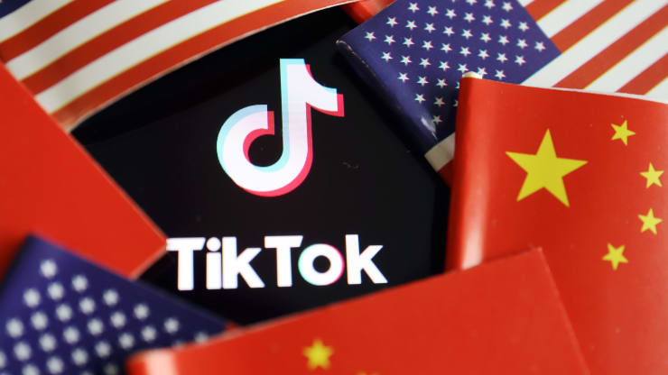

**原文通读**

**US election: TikTok in the firing line over Trump campaign fears of China influence

**In addition to the struggling economy, deteriorating China relations and the rising number of Covid-19 cases, Trump faces critical policy decisions on cybersecurity and preventing foreign interference**

**A ban on TikTok in the US could be seen as a deliberate suppression of free speech for partisan reasons, triggering higher turnouts among young people more inclined to vote against Trump**

<!--more-->

With less than 100 days to go to the US presidential election, Donald Trump and his administration are at a critical point in their bid for re-election. It will not be easy. Trailing presumptive Democratic nominee Joe Biden in the polls, Trump will need to address many issues in the coming weeks to prevent an embarrassing result in November.

TikTok, WeChat and many other Chinese social media platforms have become trending topics in the international media, yet the discussions are no longer restricted to the technology and finance spheres. After the White House implied that several Chinese social media platforms could be shut out of US cyberspace, their significance has come under greater scrutiny.

With its short videos, funny meme-style clips and algorithms to attract and retain users, TikTok is also becoming a tool to mobilise political movements. In Canada, New Democratic Party leader Jagmeet Singh tried to reach young voters on the platform in the 2019 federal election. In the US, TikTok was used to help sabotage a Trump rally in Tulsa as users registered for tickets to falsely inflate attendance numbers.

The Trump administration should be looking to evaluate potential political gains and losses on any cybersecurity and social media policy changes. The most important question for officials is whether banning Chinese mobile apps in the US will get the president more votes – or fewer – in November.

**段落精读**

**标题

**US election: TikTok** **in the firing line** **over Trump campaign fears of China influence**

**In addition to** **the struggling economy****, deteriorating China relations and the rising number of Covid-19 cases, Trump faces critical policy decisions on** **cybersecurity** **and preventing foreign interference**

**A ban on TikTok in the US could be seen as a deliberate** **suppression of free speech** **for** **partisan** **reasons, triggering higher** **turnouts** **among young people more inclined to vote against Trump**

 

**firing**意思是**射击、开枪**，比如There was continuous **firing** throughout the night.整夜**枪炮**不息。 

爱玩吃鸡的同学们可以更好理解**in the firing line**的含义，从字面上看它的意思是“在火线中”。在游戏里，冲在火线前面的人往往会成为枪靶子，所以in the firing line的准确含义就是be in a position where you are likely to be affected, attacked, criticized, etc. **处于易受影响﹙或攻击、批评等﹚的位置。** 

经济学人之前在报道华为与英国的纠纷时，也用到了这个表达：Huawei, a telecoms giant, is again **in the firing line**.电信巨头华为，又一次**处于风口浪尖**。

最近，在《三十而已》里，林有有的绿茶行为**激起了网友的怒火**，就可以借用in the firing line：Lin Youyou, an angelic bitch in the drama, is **in the firing line** of late.

要表示“**处于风口浪尖、处于众矢之**”的话，再推荐两个很好用的表达：

第一个是**bring sth to a head**，它在词典上的含义是If a problem or disagreement comes to a head or is brought to a head, it becomes so bad that something must be done about it.**到了危急关头、到了关键点**。

经济学人中曾经用到了这个表达：In the end, it was Afghanistan that **brought matters to a head**. 最终，是阿富汗把问题**推到了风口浪尖**。

第二个是**be in the cross-hairs处于风口浪尖之上**。

同样上个经济学人的例句：Firms in Hong Kong are **in the cross-hairs**, but it would be a mistake to think China will stop there. 香港的公司是**焦点**，但如果认为中国会止步于此，那就错了。

 

“**经济不景气**”怎么说？文中用到的是**a str****uggling economy**。

struggling是由struggle这个动词变化而来的，struggle有“艰难行进、努力”的意思，所以**struggling**用于形容经济时，就是指经济**状况不好**。

除了struggling这个形容词之外，要表示相同含义还可以用**gloomy, sluggish**。此外名词词组**economic depression**和**economic downturn**都可以表示“经济不景气”。

经济学人经常用到struggling economy，比如说：His popularity has ebbed too, largely owing to **a struggling economy**. 他的支持率也在下降，很大程度上是因为**经济不景气**。

 

“**新冠病例**”的说法是**Covid-19 cases**。用于医学领域时，**case**特指“**病例、病案、病人**”。例如，a severe **case** of typhoid伤寒重**病例**；The most serious **cases** were treated at the scene of the accident.受伤最严重的**人**在事故现场就得到了救治。

 

**cybersecurity网络安全**，时事中比较热的词。它可以拆分成cyber和security两个词。

**cyber**意思是“**网络的、计算机的**”，常常用作前缀和其他词一起构成新的名词或形容词。比如**cybercafe**网吧，**cyber-shoppers**网上购物者，**cyberbullying**网暴，**cybercrime**网络犯罪，**cyber-attacks**网络攻击，**cyberspace**网络空间......这些常用的表达，要信手拈来才是。

 

**suppression**是由suppress变形而来的，意思自然就是“镇压、压制”。既可以指**武力上的压制**，比如the **suppression** of a rebellion对反叛的镇压 ；同时也可以指**情感上的压制**，比如the **suppression** of emotion对感情的抑制。

 

**free speech**意思是**言论自由**，也可以说成**freedom of speech**。这个没什么好讲的，当成固定表达记下来就完事儿。

常规操作，看看经济学人例句：**Free speech** is the cornerstone not only of democracy but also of progress.**言论自由**不仅是民主的基石，也是进步的基石。

 

**partisan**意思是showing too much support for one person, group or idea, especially without considering it carefully**(对个别人、团体或思想)过分支持的，偏护的，盲目拥护的**。

**partisan**可以看做是由party派生而来的，party是党派，党派内的成员都是有个共同的思想来拥护的，所以partisan的意思就因此得来了。比如说：Most newspapers are **politically partisan**.大多数报纸都有**政治倾向**。它的意思相当于 **prejudiced, biased, one-sided**等等。

**partisan**还可以做名词，意思是 a person who strongly supports a particular leader, group or idea**坚定的支持者；铁杆拥护者**。

**[写作]**要表示“**反对者**”，就可以说**opposing partisans**。

经济学人中有个句子就是：And - taking **opposing partisan** viewpoints - it is either a working environment that offers flexibility with regard to employment hours, or... it is a form of exploitation with very little workplace protection. 拿**反对者**的观点来说，零工经济要么是一个工作环境，提供灵活的工作时间，要么这是一种几乎没有工作保护的剥削形式。

 

要掌握turnout的意思，还是得回到它的动词词组turn out上。

turn out的意思非常多，这里就不赘述了，**turn out**有一层意思是“**出席;参加;前去观看**”。比如说It was no wonder the fans **turned out**. The matches yielded 259 goals. 怪不得球迷们蜂拥而至**来观看**比赛。这些比赛共产生了 259 粒进球。

所以**turnout**有个含义是“**出席人数、到场人数**”，例如：It was a marvellous afternoon with a huge **turnout of people**. 那是个美妙的下午，**出席人数**众多。

在文中，**turnout**用于选举这个语境时，还有另一个含义**“(选举的)投票人数，投票率**”。

经济学人有个句子就是：**Low voter turnout** and rates of postcard return could be caused by “language-access problems, mail-delivery issues, inflexible work schedules and transportation issues”, she wrote. 她写道，**投票率低**和选票卡回收率低可能是“语言不通、邮件投递问题、工作安排不灵活和交通问题”造成的。

 

**参考译文：**

**美国大选：特朗普竞选期间担心中国影响，TikTok处于风口上**

**除了要应付经济下滑、中美关系恶化和新冠肺炎病例增长，特朗普还得在网络安全和防止外国干预方面做出重大决策**

**美国对TikTok的禁令可以被视为出于政治原因而对言论自由进行蓄意打压，从而导致更多的年轻人出来投票反对特朗普**

 

首先，文章开篇先描述了美国大选这个大背景，但这和Tiktok被美国封禁有什么关系呢？我们暂且往下看下去。

**With l****ess than 100** **days to** **go to** **the US presidential election,** **Donald Trump and his** **administra****tion** **are** **at a critical point** **in their bid for re-election. It will not be easy.** **Trailing presumptive** **Democratic nominee Joe Biden in the polls, Trump will need to address many issues in the coming weeks to prevent an embarrassing result in November.**

 

**[写作]**“**离……不到xxx天了**”应该怎么说？There is only xxx days left？

文中用到的是：**with less than…days to go to…**

**
**

比如说，高三学生都会经历高考倒计时的鸡血：**With less than 100 days to go to gaokao**, you’d better burn the midnight oil.

 

“**总统选举**”的固定表达是**presidential election**。

 

在新闻中经常会看到**the Trump administration**, **the Obama administration**等等，都是**总统名+administration**。在这些情况下的**administration**意思是“**政府**”，这种用法尤其常常用于美国。因为美国的政体决定了它不同总统在位时的政策、智囊团等是不一样的，所以都用总统名+administration来指代这一届的政府。

比如经济学人的例句：In October, the WTO had said that the **Trump administration** could penalize the EU by placing tariffs on $7.5bn of its exports. 去年10月，世贸组织曾表示，**特朗普政府**可能会对欧盟75亿美元的出口产品征收关税，以此惩罚欧盟。

 

**be at a critical point**的含义就是字面意思：**处于关键点上**。

**critical**还有一个含义是“**严重的、有危险的**”，比如The first 24 hours after the operation are the most **critical**.病人手术后头 24 小时是最**危险的**。 

新冠危急病人就可以说是patients in a critical condition.

 

**trail**在文中的意思是to be losing a game or other contest **(在比赛或其他竞赛中)落后，失利，失败**。它常常用于进行时，相当于**lag, straggle**等。

trail的搭配有**trail (sb) by sth**，比如Manchester United were **trailing by** two goals to one.曼联队**以**一比二的**比分落后**。

外刊在描述选举形势的时候，尤其喜欢用trail这个词，比如说经济学人的一个句子：Carlos Alvarado’s victory was an unexpected landslide. After **trailing** in almost every poll after the first round, held on February 4th, he defeated Fabricio by 61% to 39%.卡洛斯·阿尔瓦拉多出人意料地获得了压倒性的胜利。在2月4日举行的第一轮投票之后，他几乎在所有的投票中都**落后**，但他以61%对39%的优势击败了法布里希奥。

 

**presumptive**意思是likely to be true, based on the facts that are available**很可能的、假设的、推断的**，它是个比较正式的术语。它的**动词**形式是**presume假设、假定、推定**，相当于**assume**。

 

presumptive有个专业术语是**heir presumptive**意思是“**假定继承人**”。假定继承人具体是指an heir who may lose his or her legal right to receive sb's property, money or title if sb with a stronger claim is born，也就是说其继承权会因有血统更近的继承人出生而丧失，只是暂时的继承人。

唐顿庄园里的大表哥就可以说是**heir presumptive**。

 

**nominee**意思是 a person who has been formally suggested for a job, a prize, etc.**被提名人；被任命者**。例如an Oscar **nominee**获得奥斯卡**提名的人**。

这个词本身没什么好讲的，来看看它的**动词形式nominate**。它主要有两个意思：第一个意思是“**提名、推荐**”，结构是**nominate sb for/as sth**，比如He **was nominated as** the best actor.他获得了最佳男演员的**提名**。第二个意思是“**委派、任命**”，结构是**nominate sb as/to sth**，比如I have **been nominated to** the committee.我被**任命为**委员会委员。

 

**参考译文：美国总统大选还有不到100天就将开始了，唐纳德·特朗普和他的政府正处于是否能连任的关键点，但连任并不容易。川普在民调中落后于民主党总统候选人乔·拜登，因此在未来几周，川普需要解决很多问题，才能避免11月出现尴尬的选举结果。**

说完美国大选，下面这段就开始具体说Tiktok和美国大选的关系了。简而言之就是**美国年轻人在Tiktok上发起了一场活动，抱团去注册特朗普集会的门票，结果集体鸽了特朗普**。面对空荡荡的场地，特朗普只能黑脸离场。Tiktok内心OS：我还能怎么办，我也很无奈啊，终究是我一个人抗下了所有。

**With its short videos, funny meme-style clips and algorithms to attract and retain users****, TikTok is also becoming a tool to** **mobilise** **political movements. In Canada, New Democratic Party leader Jagmeet Singh tried to reach young voters on the platform in the 2019 federal election. In the US, TikTok was used to help** **sabotage** **a Trump rally in Tulsa as users registered for tickets to falsely** **inflate** **attendance numbers.**

 

抖音作为一款成功走出海外的软件，我们应该怎么介绍它的海外版TikTok呢？原文给出了标准答案，抄作业就好了：With its short videos, funny meme-style clips and algorithms to attract and retain users, TikTok is also becoming a tool to mobilise political movements. 

可以稍微做下改动：**With its short videos, funny meme-style clips and algorithms to attract and retain users, TikTok can find a fan base both at home and abroad.**

**meme**意思是a type of behaviour that is passed from members of a group to another, not in the genes but by another means such as people copying it**模仿传递行为**。但是抖音的**meme-style clips**其实就是指**很多人拍同款话题的短视频**，比如前段时间抖音里刀小刀对镜拍变身的视频火了，各路网红都纷纷拍同款，这种就是meme-style clips。

 

**mobilise**在这句话里的意思是to work together in order to achieve a particular aim; to organize a group of people to do this**组织、动员**，相当于**organize**。例如a campaign to **mobilize** support for the strike**动员**大家支持罢工的宣传活动。

 

比如江歌案件中，其母亲之前就在日本请求民众帮忙签字，想**用**公众舆论判凶手死刑，但是未能成功，这就可以说：Her attempt to **mobilize** public opinions failed.

 

**sabotage**意思是to prevent sth from being successful or being achieved, especially deliberately**刻意阻碍；妨碍；捣乱**。相当于damage。

看个经济学人的句子：But it dragged Britain into a war that ultimately **sabotaged its status as a great power**. 但它把英国卷入一场战争之中，此战让英国**丧失超级大国的地位**。

**sabotage**破坏的对象可以是车辆、设备等**硬件**，也可以是地位、方案、计划等**抽象**的东西。

像sabotage这样表示**[破坏]**的词太多了，比如：**scupper**（彻底破坏、使成泡影）；**spoil**（破坏、糟蹋）；**ravage**（毁坏、损坏、严重损害）；**sabotage**(蓄意破坏，捣乱）；**wreck**（破坏，毁灭）; **harm**（破坏，损害）。

**sabotage**后面接抽象事物，表示**[捣乱，破坏]**时，主要介绍另一个好用的表达：**rock the boat**。它的字面意思是摇晃船，所以也就自然引申出了“捣乱、搞破坏”的意思。看个经济学人的句子：Macau has a more generous welfare system than Hong Kong, including better provision of social housing. Beneficiaries are loth to **rock the boat**. 澳门的福利制度比香港更优厚，包括提供更好的社会住房。受益者不愿**打破现状**。

 

**inflate**的名词形式**inflation**很常见，意思是**通货膨胀**，它的反义词是**deflation**（**通货紧缩**）。由此可以得出**inflate**有“**（使）膨胀、吹嘘、涨价**”的含义，文中年轻人抢票就是为了**inflate（吹嘘）人数**，使得预期观众数量看上去很高的亚子。

来看个经济学人的句子：On September 5th a New York asset manager alleged that it had **inflated its sales figures**—a sign of distrust of an industry with a historically well-earned reputation for shoddy quality and shady business practices. 9月5日，纽约一家资产管理公司声称其**夸大了销售数据**——这是对一个历来以质量低劣和商业行为不正当闻名的行业的不信任。

 

那么它的反义词**deflate**我们也顺道学习一下，今天看了一篇关于日本电影《爱情人偶》的影评。听名字本来应该是一个令人遐想连篇的甜宠爱情爽剧才是，结果却走了韩剧日剧的老路子，非得安排一个人得癌症，好像不弄得生离死别就不能彰显爱情片的宏大似的，结果之前甜甜的情节都给**比下去了**，这个**比下去**了原文就用的**deflate**，来了来了：Although this is presented as a grand romantic gesture, the reality is decidedly more creepy, **deflating** what has been up to now a surprisingly sweet-natured and charming drama.虽然这部电影体现的是一种宏大的浪漫姿态，但现实显然更令人毛骨悚然，让迄今为止令人惊讶的甜蜜和迷人的剧情**黯然失色**。

**deflate**这里表示If you deflate someone or something, you take away their confidence or make them seem less important.再举个词典中的例子：All the criticism had left her feeling totally **deflated**. 所有这些批评使她**彻底失去了信心**。 

 

**参考译文：凭借短视频、有趣的模仿片段以及吸引和留住用户的算法，TikTok也正成为一种动员政治运动的工具。在加拿大2019年的联邦选举中，新任民主党领袖贾格米特·辛格就试图在tiktok平台上接触年轻选民。在美国，TikTok曾被用来帮助破坏特朗普在塔尔萨的集会，很多用户纷纷注册门票，以夸大出席人数。**

说完事情的来龙去脉之后，文章就不仅仅说Tiktok，还顺带说了微信等其他中国的社交媒体。Tiktok此次事件只是一个缩影，从中可以看出美国对于中国的态度：**生怕中国利用社交媒体来搞事情，打压它们来控评**。

 

**TikTok, WeChat and many other Chinese social media platforms have become** **trending** **topics in the international media, yet the discussions are no longer restricted to the technology and finance spheres. After the White House implied that several Chinese social media platforms could** **be shut out of US cyberspace****, their significance has** **come under greater scrutiny****.**

 

**trending topics**意思是**热门话题**。

**trending**意思是**流行的、当下的、热门的**，相当于popular。之前《都挺好》播出时候频频霸占热搜，经济学人有篇文章就这样说了：It is no mean feat to be one of the top-ten **trending** hashtags on Weibo, China’s equivalent of Twitter, for 20 consecutive days and counting. 连续20天跻身微博(中国版的推特)十大**热门**话题榜，这可不是件容易的事。

前几天瘦了的阿呆上了热搜，“**上热搜**”英文直接用了**trend**一词，我们看一下图片：

要表示**[热门的、受欢迎的]**，还可以说：**well-liked, sought-after, fashionable**。

说一说**sought-after**这个表达，它来自于动词词组seek after sb/sth，意思是**追捧某人或某物**，所以sought-after就得出了文中的意思，可以替代popular。比如说，淘宝**爆款**就可以表达成：**sought-after design**，**当红**男演员：a **sought-after** actor，“流量**真香**”：the **sought-after** influencer。

来看个经济学人的句子：One calls this the “BAT or bust” mentality, referring to Baidu, Alibaba and Tencent, three sought-after online giants. 有个毕业生管这种心态叫“非BAT不去”；BAT指的是百度、阿里巴巴和腾讯这三家备受求职者追捧的网络巨头。

 

Tiktok遭美国**封禁**怎么说：**be shut out of** US **cyberspace**。

**shut sb/sth out of sth**的意思是to prevent sb / sth from entering a place**使…不能进入；挡住；遮住**。之前推送里说华为被英国禁用，用到的词是**ban**。现在get了一个可以替代ban的词了。

看看经济学人的句子：If its debt is left to spiral down, Italy will **be shut out of** the bond markets. 如果债务继续螺旋下降，意大利将被债券市场**拒之门外**。

 

**come under scrutiny受到仔细审查**。比如说，嫌疑犯的活动**受到警方的严密监视**：Suspects’ activities have**come under** **police scrutiny**.

很显然**under+名词**，表示**进行**，也有**被动**的意思，比较熟悉的还有**under investigation, under construction**等。

scrutiny另一个高频出现的表达是**stand up to/bear scrutiny经得起认真推敲**。比如说，杭州杀妻案中的丈夫证词就**经不起推敲**：His testimony can’t **bear/stand up to close scrutiny**.

**参考译文：TikTok、微信等众多中国社交媒体平台已成为国际媒体的热门话题，但对其的讨论已不再局限于科技、金融领域。在白宫暗示美国可能禁用数家中国社交媒体平台之后，这些社交媒体的影响力收到了严格的审查。**

最后再来看看本文**对特朗普此举的评价**是什么：

**The Trump administration should be looking to evaluate potential political gains and losses on any cybersecurity and social media policy changes. The most important question for officials is whether banning Chinese mobile apps in the US will** **get the president more votes** **– or fewer – in November.**

 

这段话比较简单，主要是学习**get的双宾语**用法。如果我们自己表达“让总统获得更多的选票”，我们可能会说help the president get more votes，但是文中用的却是**get the president more votes**。道理一说都明白，get sb sth是个典型的双宾语现象，但是自己用的时候却很难想到这样写，所以是时候转换下思路了。

 

**参考译文：特朗普政府应该评估网络安全和社交媒体政策变化带来的潜在政治得失。对官员们来说，最重要的问题是，在美国禁止中国的手机应用在11月大选中会获得的是更多，还是更少的选票。**